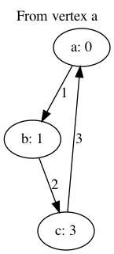

# A study of Graphs

You can see the example outputs in `examples/` as well as the script they were produced with in conjunction with the `./graph.js` module.

This experiment has been run from macOS with graphviz installed.

The following is from `./examples/a.png`. It shows the graph with distance calculated from node `a`. Distance is included on the label for each node, and the edge is labeled with the weight of that edge.

